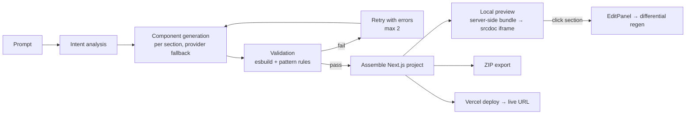

# ForgeAI

> **Prompt → rendered preview → live URL → full code. Open-source, BYOK, self-hostable.**

Type a sentence, get a real Next.js project: rendered locally in your browser (no deploy needed), exportable as a ZIP, deployable to Vercel. You bring your own AI keys, you own the code, you pay fractions of a cent per generation.

[](https://opensource.org/licenses/MIT)
[](https://nextjs.org/)

---

## What it actually does

- **Intent → plan.** Your prompt becomes a structured plan (sections, pages, palette, whether forms need a DB) — visible live before code exists.
- **Per-section generation with fallback.** Each component is generated separately through a provider chain (OpenRouter → Gemini → HuggingFace). A dead provider/model fails over; a cancel aborts in-flight calls.
- **Validated, not trusted.** Every component is esbuild-compiled + pattern-scanned (dangerous imports, missing exports); failures auto-retry with the exact errors.
- **Real local preview.** `POST /api/preview` bundles the generated files server-side (esbuild virtual-fs + compiled Tailwind) and renders them in a sandboxed iframe — including multi-page routing and click-to-edit. No deploy, no CDN.
- **Own the output.** Download a full Next.js ZIP (`output:'export'` + `serve`), or deploy to Vercel. Forms wire to your own Supabase project.
- **Honest modes.** Sidebar modes are site *types* — every mode generates a deployable Next.js site; the mode picks domain focus and section set.



## Stack

Next.js 16 · React 19 · Hono API (`api/`, port 3001) · Zustand · Tailwind · esbuild (validation + preview bundling) · JSZip · Vitest + Playwright. 13 production dependencies.

## Quick start

```bash
npm install
npm run dev:all   # API :3001 + frontend :3000
```

Open `http://localhost:3000`, add a key in Settings (Gemini is the easiest free start — see [docs/free-apis.md](docs/free-apis.md)), type a prompt, Generate.

> `Failed to proxy ... ECONNREFUSED` → the API isn't running; use `npm run dev:all`.

## Commands

| Command | What |
|---|---|
| `npm run dev:all` | frontend + API together |
| `npm run validate` | lint + typecheck + security + unit + build |
| `npm run e2e` | Playwright suite (spins both servers) |
| `npx tsx scripts/pw-drive.ts` | headed live-drive session — watch the AI walk the whole flow |
| `npx tsx scripts/smoke-assemble.ts` | assemble a project without AI keys |

## Security model (BYOK)

Keys live in your browser's IndexedDB and go straight to the provider per request — the server never stores them. Generated sites use `NEXT_PUBLIC_*` env only, CSP drops `unsafe-eval` in production, template submission is off unless `ALLOW_TEMPLATE_SUBMISSIONS=true`, rate limiting is prod-gated (`RATE_LIMIT_RPM`), and `MAX_GENERATION_COST_USD` caps per-generation spend (default $0.25).

## Status

Audited to zero open findings (113 issues found and fixed — see `runtime-docs/audit-archive-113-findings.md` locally). Current roadmap tasks live in `runtime-docs/OFFICE_BOARD.md` (gitignored, local). Roadmap: plugin system, Grow layer (analytics/email/A-B — **not shipped**), voice, messaging integrations.

## Docs

- [docs/architecture.md](docs/architecture.md) — mermaid architecture + sequence
- [docs/templates.md](docs/templates.md) — template config format
- [docs/template-gallery.md](docs/template-gallery.md) — gallery (51 curated templates)
- [docs/free-apis.md](docs/free-apis.md) — free key options
- [docs/vision.md](docs/vision.md) — why this exists
- [CONTRIBUTING.md](CONTRIBUTING.md) — PR guidelines
- `runtime-docs/CONTEXT.md` — quick project context (local, gitignored)

## FAQ

**Where do I get keys?** OpenRouter [openrouter.ai/keys](https://openrouter.ai/keys) · Gemini [aistudio.google.com/app/apikey](https://aistudio.google.com/app/apikey) · HuggingFace [hf.co/settings/tokens](https://hf.co/settings/tokens) (fine-grained, "Make calls to Inference Providers") · Vercel [account/tokens](https://vercel.com/account/tokens) · Supabase project Settings > API.

**How much does it cost?** $0 with free models (`:free` on OpenRouter, Gemini free tier, HF free credits). Paid models ~$0.002/generation.

**Timeouts?** Generation takes 30–90s; the API sends keep-alive pings and providers have 120s timeouts + fallback. A real provider outage shows the exact error.

**Do you store my keys?** No — IndexedDB only, discarded server-side after each request.

MIT. PRs welcome.
