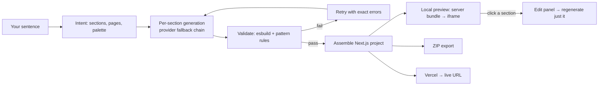

# ForgeAI

**Type a sentence. Get a real Next.js site — rendered in your browser, exportable as a ZIP, deployable to Vercel. No sign-up, no subscription, your own API keys.**

Most AI site builders charge $20–100/mo to run a model call that costs a fifth of a cent — and you never own the code. ForgeAI is the open-source version: the keys are yours, the generated project is yours, and the whole thing runs on your machine.

## Who it's for

- **Anyone who needs a landing page now** — studio, café, portfolio — and wants a real project, not a locked-in editor.
- **Developers** — skip the boilerplate: you get a typed, validated Next.js codebase you can extend.
- **The curious** — the whole pipeline is ~40 small files and readable. It makes a decent reference for how a BYOK AI generator is put together.

## What you actually get

- **A plan before code** — your prompt becomes a structured intent: sections, pages, palette, whether forms need a database.
- **Real generated components** — each section is generated separately, esbuild-compiled and pattern-scanned. Failures auto-retry with the exact errors; a dead provider fails over to the next one in your chain.
- **A preview that renders, locally** — `/api/preview` server-bundles the project (esbuild + Tailwind) into a sandboxed iframe. Click a section in it and the edit panel regenerates just that piece.
- **Files you own** — download the Next.js project as ZIP (`output:'export'`, ready for `serve`), or deploy to Vercel. Forms wire to your own Supabase.
- **Honest limits** — modes are site *types*: everything produces a deployable Next.js site. Analytics/email/A-B are roadmap, not shipped.



## 60-second start

```bash
npm install
npm run dev:all
```

Open `localhost:3000` → Settings → paste one AI key ([free options](docs/free-apis.md)) → type a prompt → Generate. The preview renders right there; export or deploy when you like it.

`ECONNREFUSED` on generate → the API isn't up; `dev:all` starts both.

## Commands

| Command | Does |
|---|---|
| `npm run dev:all` | frontend :3000 + API :3001 |
| `npm run validate` | lint + typecheck + security + unit + build |
| `npm run e2e` | Playwright (spins both servers itself) |
| `npx tsx scripts/pw-drive.ts` | headed AI-driven browser session — watch it walk the whole flow |
| `npx tsx scripts/smoke-assemble.ts` | assemble a project with zero AI keys |

## Where your keys go

Nowhere near us. They live in your browser's IndexedDB and are forwarded per-request as an auth header — the server never stores them. Self-hosters can use `.env` instead. Extras: prod-gated rate limiting, `MAX_GENERATION_COST_USD` spend cap per generation (default $0.25), zip-slip/traversal validation on every file map, CSP without `unsafe-eval`.

## Stack

Next.js 16 · React 18 · Hono API · Zustand · Tailwind · esbuild · JSZip · Vitest + Playwright. 13 production deps, all earned.

## Status

Freshly audited: 113 issues found and fixed (fake analytics removed, traversal holes closed, preview made real). Example output lives in `generated proj/yoga-studio/` — a genuinely generated site that builds clean. Open roadmap: plugin registry, Grow layer, voice/messaging.

## Docs

[architecture](docs/architecture.md) (mermaid) · [templates](docs/templates.md) · [gallery](docs/template-gallery.md) · [free keys](docs/free-apis.md) · [vision](docs/vision.md) · [contributing](CONTRIBUTING.md) · [changelog](CHANGELOG.md)

MIT — do what you want with it.
