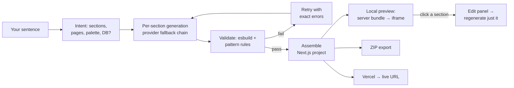

# ForgeAI

**Type a sentence. Get a real Next.js site — rendered in your browser, exportable as a ZIP, deployable to Vercel. No sign-up, no subscription, your own API keys.**

Most AI site builders charge $20–100/mo to run a model call that costs a fifth of a cent — and you never own the code. ForgeAI is the open-source version: the keys are yours, the generated project is yours, and the whole thing runs on your machine.

## Who it's for

- **Anyone who needs a landing page now** — studio, café, portfolio — and wants a real project, not a locked-in editor.
- **Developers** — skip the boilerplate: you get a typed, validated Next.js codebase you can extend.
- **The curious** — the whole pipeline is ~40 small files and readable. It makes a decent reference for how a BYOK AI generator is put together.

## What a generation actually does

Not one big "generate everything" call — a pipeline where every stage is observable and interruptible:



1. **Intent** — the prompt becomes structured JSON: which sections, which pages, palette, whether forms need a database. This is what drives the file map later — a prompt asking for a gallery, pricing and contact produces a site with exactly those sections.
2. **Per-section generation** — every component is a separate paid call through your provider chain (OpenRouter → Gemini → HuggingFace, free tiers included). One provider 401s or times out → the next picks up; nothing is lost.
3. **Validation** — generated code is esbuild-compiled and pattern-scanned: no `eval`, no `dangerouslySetInnerHTML`, only allow-listed imports, `` can't point at local files that don't exist, forms need names. Failures auto-retry with the exact error fed back — and a second failure marks just that section, the rest still assembles.
4. **Assembly** — a real Next.js App Router project: typed layout, compiled Tailwind, per-page routes, sitemap/robots, and `FormHandler` + Supabase migration when the intent says a database is needed.
5. **Local preview** — `/api/preview` bundles the whole file map server-side into a sandboxed `srcdoc` iframe. You see the actual rendered site before anything is deployed; clicking a section opens an editor that regenerates only that component and swaps it back in.
6. **Take it home** — ZIP export (`output:'export'`, `serve out` and it runs), or Vercel deploy to a live URL. Projects persist locally (IndexedDB) — reopen, rename, duplicate, redeploy.

If the stream dies mid-way, the error screen offers **"Retry N failed sections"** — it regenerates just those and reassembles, instead of burning the whole run.

## Honest limits

- Everything produces a deployable **Next.js site**. The mode chips (mini-app, SaaS, game…) shape sections and tone — they don't change the stack.
- No image generation — generated sites use CSS/gradients/icons, not fake ``.
- Grow features (analytics, email, A/B) are roadmap, not shipped. The vision doc says so.
- Quality is prompt-dependent: the same prompt won't render the same site twice, and a one-word prompt gets a generic result.

## 60-second start

```bash
npm install
npm run dev:all
```

Open `localhost:3000` → Settings → paste one AI key ([free options](docs/free-apis.md)) → type a prompt → Generate.

`ECONNREFUSED` on generate → the API isn't up; `dev:all` starts both processes (frontend :3000 + API :3001).

## Commands

| Command | Does |
|---|---|
| `npm run dev:all` | frontend + API |
| `npm run validate` | lint + typecheck + security + unit + build |
| `npm run e2e` | Playwright (spins both servers itself) |
| `npx tsx scripts/pw-drive.ts` | headed AI-driven browser session — watch it walk the whole flow |
| `npx tsx scripts/smoke-assemble.ts` | assemble a project with zero AI keys |

## BYOK — where your keys go

Nowhere near us. Keys live in your browser's IndexedDB and are forwarded per-request as an auth header — the server never stores them. Self-hosters can use `.env` instead. Safety rails on top: prod-gated rate limiting, `MAX_GENERATION_COST_USD` spend cap per generation (default $0.25, configurable), zip-slip/traversal validation on every file map, CSP without `unsafe-eval`, sandboxed preview iframe.

## Stack

Next.js 16 · React 18 · Hono API · Zustand · Tailwind · esbuild · JSZip · Vitest + Playwright. 13 production deps, all earned.

## Status

Freshly audited: 113 issues found and fixed — fake analytics removed, traversal holes closed, the preview made real instead of a mock. Example output lives in `generated proj/yoga-studio/` — a genuinely generated site that `next build`s clean. Open roadmap: plugin registry, Grow layer, voice/messaging.

## Docs

[architecture](docs/architecture.md) (mermaid + sequences) · [templates](docs/templates.md) · [gallery](docs/template-gallery.md) · [free keys](docs/free-apis.md) · [vision](docs/vision.md) · [contributing](CONTRIBUTING.md) · [changelog](CHANGELOG.md) · [security](SECURITY.md)

MIT — do what you want with it.
