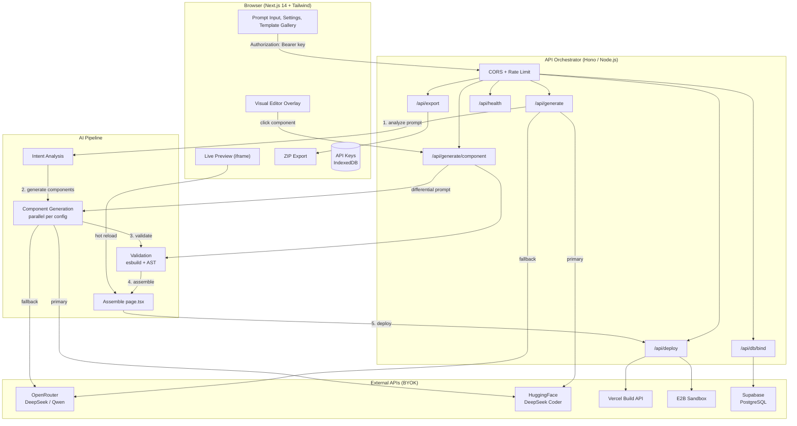

# ForgeAI

> **Prompt → Live URL → Full Code. Open-source, BYOK, self-hostable.**

Turn a single sentence into a deployed, working website with database, forms, and custom domain — in ~15 seconds. You bring your own API keys, you own the code, you pay fractions of a cent per generation.

[](https://opensource.org/licenses/MIT)
[](https://github.com/your-username/forgeai/pulls)
[](https://nextjs.org/)
[](https://openrouter.ai/)

---

## Why This Exists

Existing AI website builders are closed, expensive, and lock you in. You don't own the code, you can't choose your models, you can't self-host, and you pay $20-100/month for something that costs $0.002 to actually run.

This project is the open-source alternative. You connect your own API keys (OpenRouter, HuggingFace, Supabase), pay only for what you use, and export the full project as code. MIT licensed, self-hostable, extensible.

---

## Who This Is For

- **Small business owners** — need a website with booking, contact forms, or lead capture in 5 minutes, not 5 weeks
- **Content creators** — landing pages for podcasts, videos, newsletters, courses
- **Solo founders** — validate an idea with a live site before writing any code
- **Developers** — skip the boilerplate. Get a full Next.js project you own and can extend
- **Open-source community** — contribute models, templates, deploy providers, components

---

## Features

### Plan → Build → Grow

The agent follows a three-phase workflow:

**1. Plan** — You type your idea. The agent analyzes it, asks clarifying questions (audience, style, features needed), and shows you a visual plan: what sections it will build, what components, what database tables. You approve or adjust before anything is generated.

**2. Build** — The agent generates each component separately using config-driven specs (not one giant blob of code), validates every component with esbuild, and assembles a complete Next.js project. You get:

- Live URL (deployed via Vercel or E2B sandbox)
- Full React + Tailwind code, downloadable as ZIP
- Auto-generated database schema (Supabase) if your site has forms
- Inline visual editor — click any block, describe a change, it updates in place
- Version history with one-click rollback

**3. Grow** ✅ v1.0 — After deployment, automate the repetitive work:

- SEO optimization (meta tags, sitemap, structured data)
- Analytics dashboard (visitors, page views, conversions)
- Automated email reminders for sign-ups and bookings
- FAQ auto-responses for common customer questions
- A/B testing for headlines and CTAs
- Social media scheduling from your site content

### Core Capabilities

| Feature                  | Status | Description                                                                                    |
| ------------------------ | ------ | ---------------------------------------------------------------------------------------------- |
| Prompt-to-Live-URL       | v0.2   | Type a sentence → get a deployed URL in ~15s                                                   |
| Config-driven generation | v0.1   | Each component generated from a strict spec with skeleton, system prompt, and validation rules |
| Multi-model fallback     | v0.2   | HuggingFace → OpenRouter → next model. No downtime if one provider is down                     |
| Visual editor overlay    | v0.3   | Click any block in the preview → describe a change → only that component regenerates           |
| Differential prompting   | v0.3   | Edits send only the changed component, not the whole page. Faster, cheaper, more precise       |
| ZIP export               | v0.4   | Download the full Next.js project: components, configs, package.json, README                   |
| Auto-database binding    | v0.4   | Forms on the page auto-generate Supabase SQL schema and wire up form submissions               |
| Version history          | v0.3   | Every edit is a version. Roll back to any state with one click                                 |
| Template library         | v0.5   | Start from a template (landing, portfolio, dashboard, e-commerce) and customize with a prompt  |
| Multi-page generation    | v0.6   | Home, About, Contact, Blog — with navigation and routing                                       |
| Plugin system            | v0.7   | Add your own AI models, deploy providers, templates, and components                            |
| Grow layer               | v1.0   | SEO, analytics, email automation, A/B testing, social scheduling                               |
| AI voice agent           | future | Add a voice agent to any deployed site — visitors speak, AI responds                           |
| Messaging integration    | future | Run the agent from Telegram, Slack, Discord                                                    |

### How Generation Works

```
Your prompt: "Landing for yoga studio with booking form"

Step 1: Intent Analysis
  → AI parses: type=landing, sections=[navbar, hero, features, pricing, contact-form, footer]
  → palette=calm-green, dbRequired=true, dbForms=[contact-form]

Step 2: Component Generation (parallel, each from its own config spec)
  → navbar.config.ts  → AI generates Navbar.tsx
  → hero.config.ts    → AI generates Hero.tsx
  → features.config.ts → AI generates Features.tsx
  → pricing.config.ts → AI generates Pricing.tsx
  → contact-form.config.ts → AI generates ContactForm.tsx (+ Supabase wiring)
  → footer.config.ts  → AI generates Footer.tsx

Step 3: Validation
  → esbuild parses each component
  → AST check: default export? no forbidden imports? no XSS? has Tailwind classes?
  → If any fail → auto-retry with the exact error message (max 2 retries)

Step 4: Assembly
  → All components → page.tsx with imports
  → package.json, tailwind.config, tsconfig, globals.css

Step 5: Deploy
  → Vercel Build API or E2B sandbox → live URL

Step 6: DB Binding (if forms detected)
  → SQL schema generated → Supabase tables created → form wired up
```

Each component config includes:

- **System prompt** — strict rules (React + Tailwind only, return JSON, no inline styles)
- **Skeleton** — base file structure pre-written, AI fills the content
- **Schema** — expected response shape
- **Validation rules** — what to check after generation
- **Model fallback chain** — which AI models to try, in order

This means the AI generates small, focused, validated components — not a giant blob of broken code.

---

## Architecture



For full sequence diagrams and data flow, see [docs/architecture.md](docs/architecture.md).

---

## Screenshots

> UI is built and working. Add real screenshots by running `npm run dev`, generating a site, and exporting PNGs into `public/screenshots/`.

| Screen                       | Preview                                  |
| ---------------------------- | ---------------------------------------- |
| Prompt input                 | `public/screenshots/prompt.png`          |
| Generation progress          | `public/screenshots/progress.png`        |
| Live preview + visual editor | `public/screenshots/editor.png`          |
| Template gallery             | `public/screenshots/gallery.png`         |
| Settings / API keys          | `public/screenshots/settings.png`        |

---

## Tech Stack

| Layer            | Technology                          | Why                                 |
| ---------------- | ----------------------------------- | ----------------------------------- |
| Frontend         | Next.js 14 + Tailwind + shadcn/ui   | Fast, beautiful, SSR                |
| API Orchestrator | Hono (Node.js)                      | 15KB, minimal, fast                 |
| AI Intent        | OpenRouter (DeepSeek V3, Qwen)      | Cheap, multi-model                  |
| AI Code Gen      | HuggingFace (DeepSeek Coder, GLM-4) | Free tier, open-source models       |
| Deploy           | Vercel Build API / E2B Sandbox      | Instant live URL                    |
| Database         | Supabase                            | Free tier, PostgreSQL, auto-binding |
| State            | Zustand                             | 3KB, no boilerplate                 |
| Export           | JSZip                               | ZIP archive                         |
| Validation       | esbuild                             | Fast code parsing and bundling      |

**9 production dependencies.** No Redux, no Axios, no Lodash, no Moment. Every dependency earns its place.

---

## Cost

| Step                      | Model                        | Cost        |
| ------------------------- | ---------------------------- | ----------- |
| Intent analysis           | DeepSeek V3 (OpenRouter)     | $0.0003     |
| Component generation (×6) | DeepSeek Coder (HuggingFace) | $0.0012     |
| Validation retry (avg 1)  | DeepSeek Coder (HuggingFace) | $0.0003     |
| Layout assembly           | DeepSeek V3 (OpenRouter)     | $0.0005     |
| **Total per generation**  |                              | **~$0.002** |

Compare: $0.15-0.30 with GPT-4o, $0.10-0.20 with Claude. This stack is **50-100x cheaper**.

---

## Getting Started

### Prerequisites

- Node.js 18+
- An OpenRouter API key (get one at [openrouter.ai/keys](https://openrouter.ai/keys))
- Optional: HuggingFace token ([hf.co/settings/tokens](https://hf.co/settings/tokens)) for cheaper code generation
- Optional: Supabase project ([supabase.com](https://supabase.com)) for database features
- Optional: Vercel token ([vercel.com/account/tokens](https://vercel.com/account/tokens)) for deployment

### Quick Start — No Code Needed (Hosted Version)

Wait, you don't want to install anything? Same.

Once a hosted version exists, it will work like this:

1. Open the website
2. Enter your API key in Settings
3. Type your idea
4. Get a live URL

For now, self-host or ask a developer friend to run it for you.

### Install & Run — For Developers

```bash
git clone https://github.com/forgeai/forgeai.git
cd forgeai
npm install
```

Start the API orchestrator in one terminal:

```bash
npm run api
```

Start the Next.js frontend in another:

```bash
npm run dev
```

Open `http://localhost:3000`, enter your API keys in Settings, type your idea, and hit Generate.

The frontend proxies `/api/*` requests to the orchestrator via `API_URL` (default `http://localhost:3001`).

### Self-Hosting

```bash
# .env
OPENROUTER_API_KEY=sk-or-xxx
HUGGINGFACE_TOKEN=hf_xxx
SUPABASE_URL=https://xxx.supabase.co
SUPABASE_KEY=sb_xxx
VERCEL_TOKEN=xxx
API_PORT=3001
API_URL=http://localhost:3001
CORS_ORIGINS=http://localhost:3000

docker-compose up
```

Or run without Docker:

```bash
npm run build
npm start
```

---

## BYOK (Bring Your Own Keys)

Your API keys are stored in your browser's IndexedDB — never on our server. When you make a request, the key is sent as an Authorization header, forwarded to the provider, and immediately discarded from server memory.

For self-hosted deployments, you can put keys in `.env` instead.

**You pay the provider directly. We never see your keys, never charge you, never add a markup.**

---

## Plugin System

Add your own:

```typescript
// plugins/providers/my-provider.ts
import type { AIProvider } from '@/types'

export const MyProvider: AIProvider = {
  name: 'my-provider',
  async generate(prompt, config) {
    // call your API
    return { code: '...' }
  },
  async health() {
    return true
  },
}
```

```typescript
// plugins/deployers/my-deployer.ts
import type { Deployer } from '@/types'

export const MyDeployer: Deployer = {
  name: 'my-deployer',
  async deploy(files) {
    // deploy to your platform
    return { url: 'https://...', deployId: '...' }
  },
  async status(deployId) {
    return { status: 'ready', url: '...' }
  },
}
```

Register in `plugins/index.ts`. No core code changes needed.

---

## Project Structure

```
forgeai/
├── src/
│   ├── app/                    # Next.js app router
│   ├── components/             # UI components (shadcn/ui)
│   ├── stores/                 # Zustand stores (project, keys, ui)
│   ├── lib/                    # Utilities (validation, helpers)
│   │
│   ├── configs/                # Config-driven generation + template constraints
│   │   ├── templates/          # Template configs with strict AI scope (10 functions)
│   │   │   ├── website.json
│   │   │   ├── slides.json
│   │   │   ├── images.json
│   │   │   ├── videos.json
│   │   │   ├── chat.json
│   │   │   ├── reports.json
│   │   │   ├── canvas.json
│   │   │   ├── carousel.json
│   │   │   ├── audio.json
│   │   │   ├── spreadsheets.json
│   │   │   └── index.json
│   │   │
│   │   ├── intent.config.ts
│   │   ├── layout.config.ts
│   │   ├── components/         # Per-component configs
│   │   ├── deploy/             # Deploy provider configs
│   │   └── db/                 # Database schema configs
│   └── plugins/                # Extensible plugins
│       ├── providers/          # AI providers
│       ├── deployers/          # Deploy providers
│       └── templates/          # Site templates
├── api/                        # Hono orchestrator
├── docs/                       # Documentation
└── docker-compose.yml
```

---

## Roadmap

| Version    | Status             | Deliverable                                                                                                           |
| ---------- | ------------------ | --------------------------------------------------------------------------------------------------------------------- |
| **v0.0**   | ✅ **Done**        | System design, docs, brand, `package.json`, types, repo setup                                                         |
| **v0.1**   | ✅ **Done**        | Prompt → generated code + config-driven generation                                                                    |
| **v0.2**   | ✅ **Done**        | Prompt → live URL + multi-model fallback                                                                              |
| **v0.3**   | ✅ **Done**        | Visual editor overlay + differential prompting + version history                                                      |
| **v0.4**   | ✅ **Done**        | ZIP export + Supabase auto-binding                                                                                    |
| **v0.5**   | ✅ **Done**        | Template gallery (15,000+ templates) + community templates                                                            |
| **v0.6**   | ✅ **Done**        | Multi-page generation                                                                                                 |
| **v0.7**   | ✅ **Done**        | Plugin system                                                                                                         |
| **v1.0**   | ✅ **Done**        | Grow layer (SEO, analytics, email automation, A/B testing) + security, performance, tests, and full release           |
| **Future** | 💡 **Idea**        | AI voice agent, messaging integration (Telegram/Slack/Discord), image/video generation, canvas mode, audio generation |

### What's Done So Far

- ✅ Complete system design (`docs/system-design.md`)
- ✅ Public docs in English: `docs/vision.md`, `docs/features.md`, `docs/system-design.md`, `docs/templates.md`, `docs/template-gallery.md`, `docs/architecture.md`
- ✅ Internal docs in `internal/` (gitignored) for core maintainers
- ✅ Feature spec (`docs/features.md`)
- ✅ Template constraint configs (`configs/templates/*.json`)
- ✅ Template gallery spec (`docs/template-gallery.md`)
- ✅ GitHub setup, README, CONTRIBUTING, LICENSE
- ✅ `package.json` with 9 production deps
- ✅ TypeScript interfaces (`src/types.ts`)
- ✅ `.env.example`, `Dockerfile`, `docker-compose.yml`
- ✅ BYOK + security model documented
- ✅ SEO, analytics, email automation, A/B testing (Grow layer v1.0)
- ✅ Unit + integration + E2E tests (Vitest + Playwright)
- ✅ Performance + security hardening for v1.0 release

### Next Up

1. Next.js project scaffold + Tailwind + shadcn/ui
2. Settings UI for API keys (IndexedDB)
3. Prompt input + intent analysis
4. Component generation + validation pipeline
5. Live preview in iframe
6. Deploy via Vercel / E2B

---

## Contributing

MIT licensed. PRs welcome. See [CONTRIBUTING.md](CONTRIBUTING.md) for guidelines and [docs/system-design.md](docs/system-design.md) for architecture details.

---

## FAQ

**Where do I get API keys?**

- OpenRouter: [openrouter.ai/keys](https://openrouter.ai/keys) — sign up, create a key, add $1-5 credit
- HuggingFace: [hf.co/settings/tokens](https://hf.co/settings/tokens) — sign up, create a Read token (free)
- Supabase: [supabase.com](https://supabase.com) — create a project (free tier), find keys in Settings > API
- Vercel: [vercel.com/account/tokens](https://vercel.com/account/tokens) — create a token

**How much does it cost?**
~$0.002 per generation. You pay the AI provider directly. $1 of OpenRouter credit = ~500 generations.

**Can I use GPT-4 or Claude?**
Yes. OpenRouter supports GPT-4o, Claude, Gemini, Llama, and 200+ other models. Just change the model in Settings. Cost will be higher (~$0.15-0.30 per generation with GPT-4o).

**Do you store my API keys?**
No. Keys are stored in your browser's IndexedDB and sent per-request as Authorization headers. The orchestrator forwards them to the provider and immediately discards them. For self-hosted, you can use `.env` instead.

**Can I self-host this?**
Yes. `docker-compose up` or `npm run build && npm start`. See `.env.example` for required variables.

**Can I add my own AI model?**
Yes. Create a plugin in `src/plugins/providers/`. See [CONTRIBUTING.md](CONTRIBUTING.md).

**Is there a hosted version?**
Not yet. Self-host for now. A hosted version may come later for those who don't want to set up keys.

**How is this different from bolt.new / Lovable / v0?**
Those are closed SaaS. You don't own the code, can't choose models, can't self-host, pay $20-100/month. ForgeAI is open-source, BYOK, self-hostable, and costs ~$0.002/generation.

---

## Comparison

| Feature          | ForgeAI       | bolt.new   | Lovable    | v0         | Runable |
| ---------------- | ------------- | ---------- | ---------- | ---------- | ------- |
| Open Source      | ✅ MIT        | ❌         | ❌         | ❌         | ❌      |
| Own the code     | ✅ ZIP export | ⚠️ limited | ⚠️ limited | ⚠️ limited | ❌      |
| BYOK             | ✅            | ❌         | ❌         | ❌         | ❌      |
| Self-host        | ✅            | ❌         | ❌         | ❌         | ❌      |
| Cost/generation  | ~$0.002       | $20+/mo    | $20+/mo    | $20+/mo    | $20+/mo |
| Plugin system    | ✅            | ❌         | ❌         | ❌         | ❌      |
| Template gallery | ✅ 15,000+    | ❌         | ❌         | ❌         | ✅      |
| Visual editor    | ✅            | ✅         | ✅         | ❌         | ✅      |
| Auto-database    | ✅ Supabase   | ❌         | ⚠️         | ❌         | ✅      |
| Grow layer       | ✅ v1.0       | ❌         | ❌         | ❌         | ✅      |

---

## GitHub Topics

```
ai, ai-agent, prompt-to-website, code-generation, nextjs, react, tailwindcss,
shadcn-ui, open-source, byok, self-hosted, supabase, openrouter, huggingface,
deepseek, text-to-code, low-code, no-code, landing-page-generator, website-builder,
template-engine, config-driven, plugin-architecture, vercel, e2b, typescript
```

---

## Star History

<!-- uncomment after first star
[](https://star-history.com/#your-username/forgeai&Date)
-->

---

## License

[MIT](LICENSE) — do whatever you want. Fork it, host it, sell it, extend it.

---

<p align="center">
  <strong>ForgeAI</strong> — Prompt → Live URL → Full Code<br>
  Open-source. BYOK. Self-hostable. ~$0.002 per generation.
</p>
