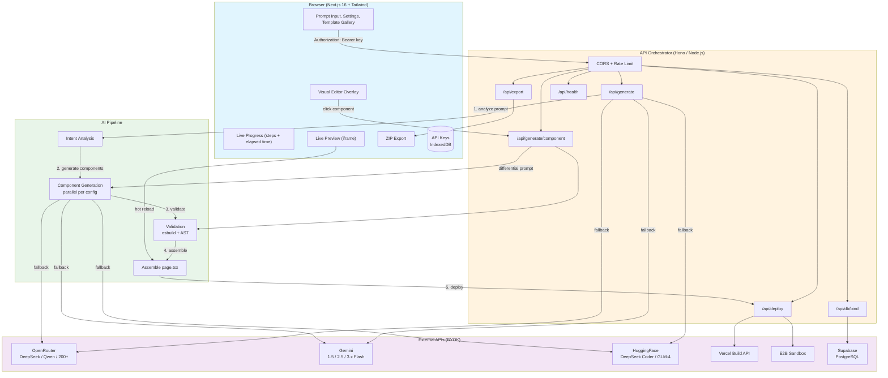
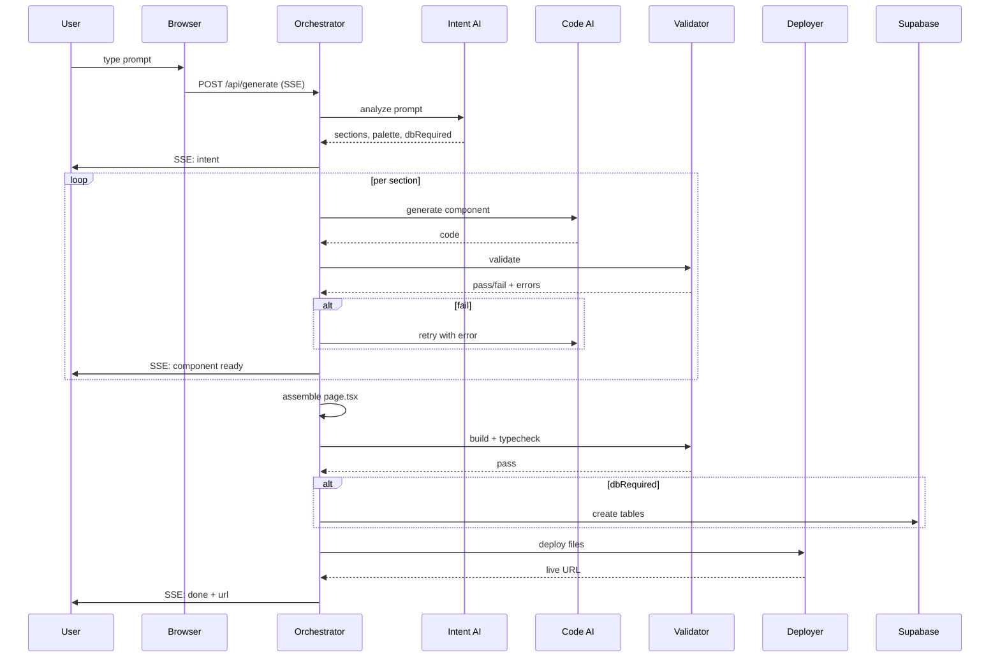

# Architecture

> Visual overview of ForgeAI's architecture.

---

## Mermaid Diagram



---

## Sequence: Prompt → Live URL



---

## Data Flow

```
1. Browser sends prompt + Authorization header (user API key)
2. Orchestrator forwards to OpenRouter / Gemini / HuggingFace fallback chain
3. Based on intent, loads per-component config from configs/
4. Calls AI for each component in parallel
5. Validates each component (esbuild, AST, lint)
6. Retries failed components with exact error
7. Assembles page.tsx, package.json, tailwind.config
8. Runs build/typecheck on assembled project
9. Deploys to Vercel or E2B
10. (Optional) Creates Supabase tables and binds forms
11. Returns live URL to browser
12. Browser shows live preview in iframe
13. User clicks component → only that component regenerates
```
