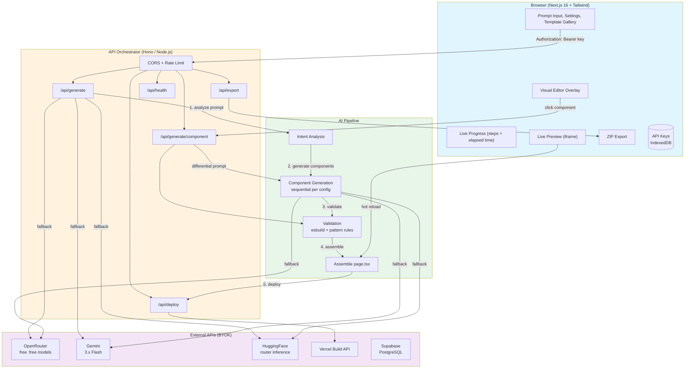
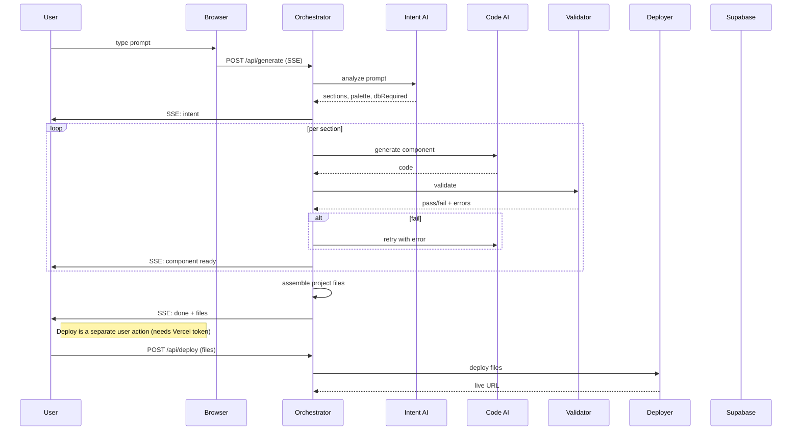

# Architecture

> Visual overview of ForgeAI's architecture.

---

## Mermaid Diagram



---

## Sequence: Prompt → Live URL



---

## Data Flow

```
1. Browser sends prompt + API keys in the request body (BYOK)
2. Orchestrator analyzes intent via OpenRouter / Gemini / HuggingFace fallback chain
3. Loads the template config for the selected mode (configs/templates/)
4. Calls AI for each section sequentially (deterministic order)
5. Validates each component (esbuild transform + pattern rules + dep allowlist)
6. Retries failed components with exact errors (max 2 attempts)
7. Assembles page files, package.json, tailwind config
8. Returns all files to the browser (SSE done event)
9. Browser can then POST files to /api/deploy → Vercel live URL
10. (Optional) Generated project includes Supabase wiring when dbRequired
11. Browser shows the deployed site in an iframe
12. User clicks component → only that component regenerates
```
